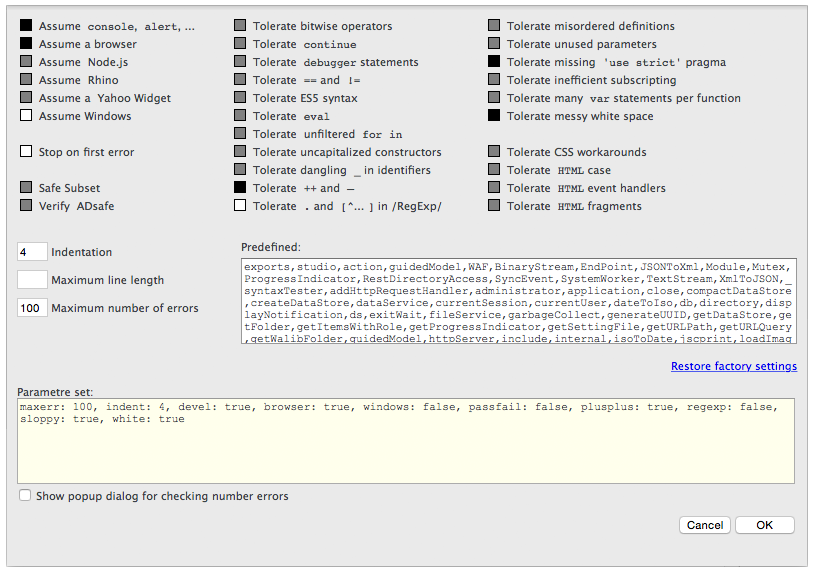

## JSLint Extension for [Wakanda](http://wakanda.org)
The __JSLint__ extension searches for any problems based on Douglas Crockford's [JSLint](http://www.jslint.com/) program.

### Installing the JSLint Extension
To install the __JSLint__ extension, use [Add-Ons](http://doc.wakanda.org/WakandaStudio0/help/Title/en/page4263.html) in Wakanda Studio.

### Using the JSLint Extension
With the __JSLint__ extension, you can either:

* **Check Errors**: Check for errors in your JavaScript file.
* **Clean Errors**: The options allow you to tune JsLint's check more or less strict.
* **Settings**: Define the settings for JSLint.

In the settings, you can define the following options:

